```{r setup, include = FALSE}
library(knitr)
library(tidyverse)
library(icons)
library(xaringanExtra)

# set default options
opts_chunk$set(fig.width = 7.252,
               fig.height = 4,
               dpi = 300)
xaringanExtra::use_panelset()
xaringanExtra::use_tile_view()
```

```{r metathis, echo=FALSE}
library(metathis)
meta() %>%
  meta_name("github-repo" = "ivelasq/") %>% 
  meta_social(
    title = "git Through April: R Studio GUI",
    description = paste(
      "Slides for R-Ladies Seattle Presentation"
    ),
    url = "https://github.com/kdillmcfarland/2021-04-02-r-ladies-seattle-online/",
    og_type = "website",
    og_author = "Isabella Velásquez",
    twitter_card_type = "summary_large_image",
    twitter_creator = "@ivelasq",
    twitter_site = "@ivelasq"
  )
```

class: title-slide, left, bottom
background-image: url(img/cover.jpg)
background-size: cover

.pull-left[
# `r rmarkdown::metadata$title`
----
## **`r rmarkdown::metadata$subtitle`**
## `r rmarkdown::metadata$institute`
### `r rmarkdown::metadata$author`
### `r rmarkdown::metadata$date`
]

.palegrey[.right[.footnote[Photo by [Ultra Tuna Fish](https://unsplash.com/@ultratunafish)]]]
---
class: inverse, middle, left

# Introduction

--

.pull-left[

# Objectives
Understand how to use Git from RStudio.
]

--

.pull-right[
# Topics Introduced

* Using Terminal in RStudio
* "Finding" Git in RStudio
* Creating or opening a project
* Working with RStudio's tools
* Linking your project to GitHub
* Committing and pushing up changes
]

---

# Quick recap: finding the GitHub repository URL

--

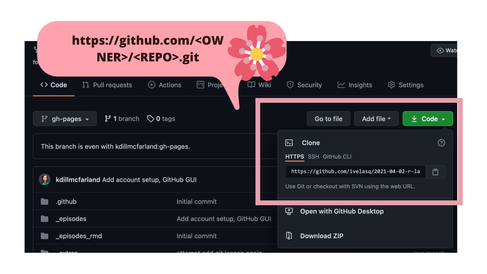

---

# Shell ... in RStudio?!

R Studio has a shell in the IDE in the Terminal tab.

--

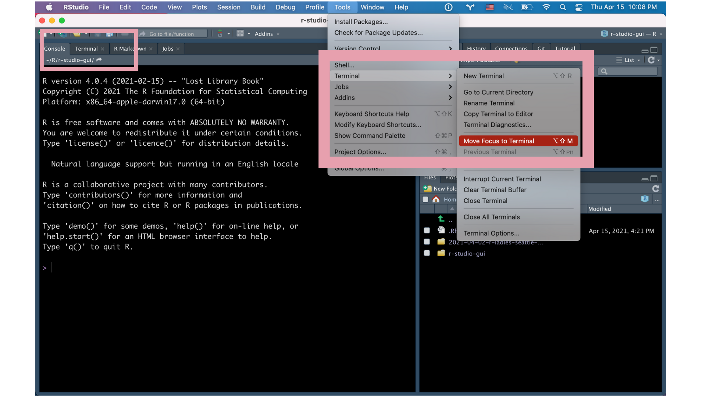

---
class: left

# Using Git from RStudio prerequisites

.pull-left-narrow[.center[
]]
.pull-right-wide[### you've registered for GitHub]

--

.pull-left-narrow[.center[
]]
.pull-right-wide[### you've installed or updated RStudio]

--

.pull-left-narrow[.center[
]]
.pull-right-wide[### you've installed Git]

--

.pull-left-narrow[.center[
]]
.pull-right-wide[### you've introduced yourself to Git]

--

.pull-left-narrow[.center[
]]
.pull-right-wide[### you can push to/pull from GitHub from the command line]

---

# Where's your Git?

.panelset[
.panel[.panel-name[Check if it is installed]

To see if Git is installed:

```{bash, eval = FALSE}
git
```

]

.panel[.panel-name[Check where it is]

To see where Git 'lives':

* Enter `which git `(Mac, Linux, Git Bash shell on Windows)
* Enter `where git` (Windows command prompt, i.e. cmd.exe)

```{bash, eval = FALSE}
which git
```

]

.panel[.panel-name[Check it is enabled]

1. Tools > Global Options > Git/SVN
2. Enable version control interface for RStudio projects
3. If necessary, enter the path for your Git or SVN executable where provided

<center>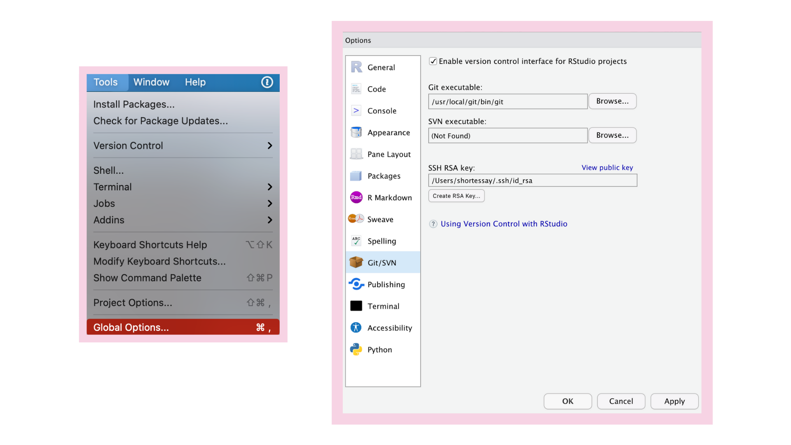</center>
]
]

---

# Creating a project

Once we know that Git is installed correctly and RStudio knows where it is, create a new project. 

* File > New Project

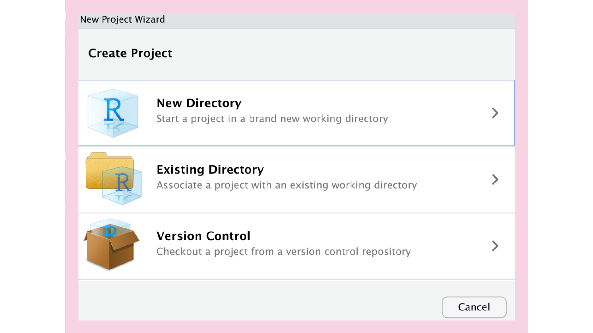

---

# Version Control

.pull-left-narrow[.center[Select Version Control]]

.pull-right-wide[
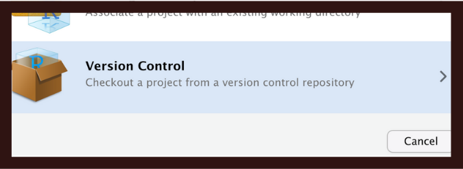
]

--

.pull-left-narrow[.center[Select Git]]

.pull-right-wide[
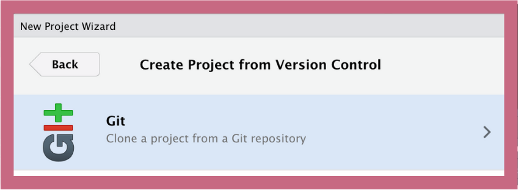
]

--
.pull-left-narrow[.center[Clone Repository]]

.pull-right-wide[
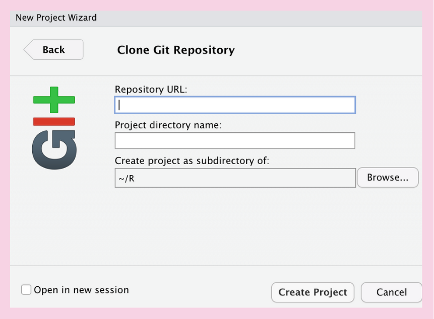
]

---

# Existing Directory

1. Click Existing Directory
2. Browse to the project working directory

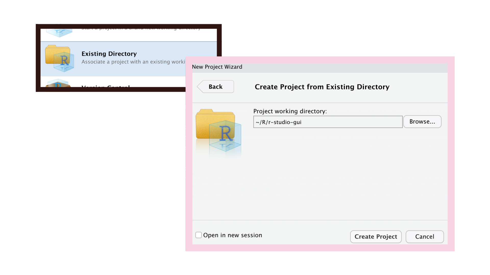
---

# New Directory

.pull-left-narrow[.center[Click New Directory]]

.pull-right-wide[
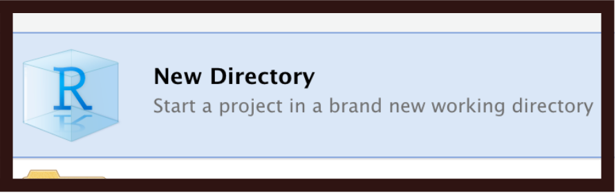
]

--

.pull-left-narrow[.center[Select New Project]]

.pull-right-wide[
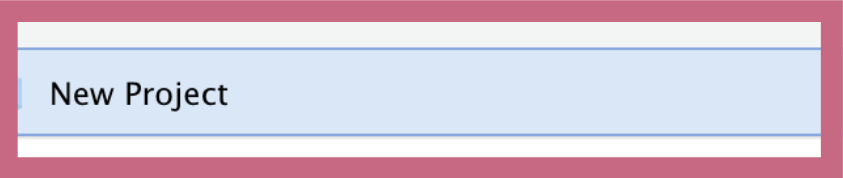
]

--

.pull-left-narrow[.center[Give the project directory a name and check "create a git repository"]]

.pull-right-wide[
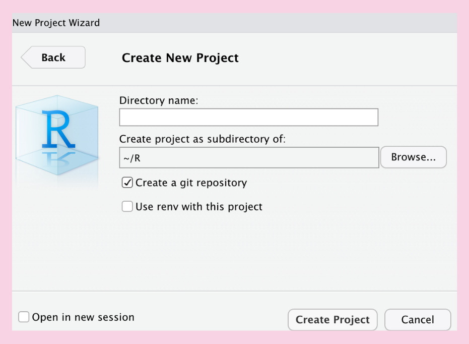
]

---

# Checking out the Git tools in RStudio

--

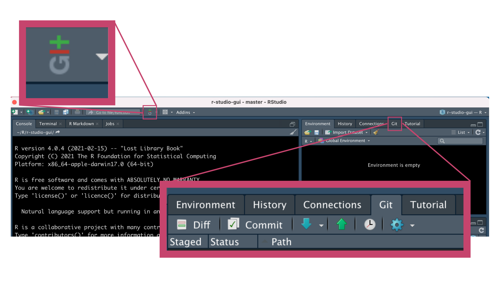

---

# Linking your project to GitHub

.panelset[
.panel[.panel-name[See if project is linked]
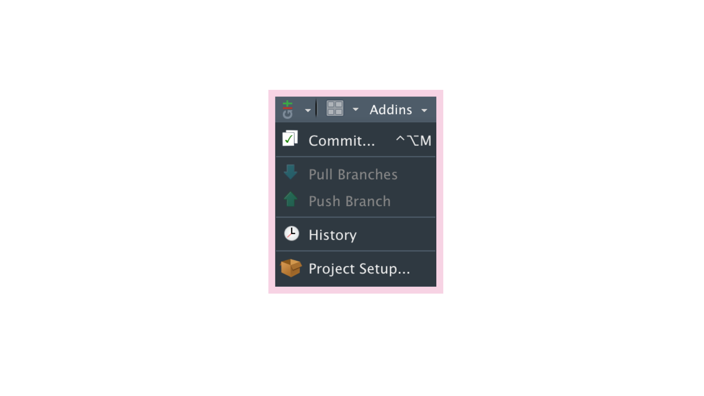
]

.panel[.panel-name[If not, link project]
```{bash, eval = FALSE}
# point to remote URL
git remote add origin https://github.com/ivelasq/myrepo.git

# download all the files from the online GitHub repository
git pull origin master

# set the current branch to track a branch on the remote
git branch -vv

# set local master branch to track master on GitHub
# this is equivalent to git push -u origin master but more specific
git push --set-upstream origin master
```
]
]

---

# Committing changes

* Open up a file (e.g., index.md):

.panelset[
.panel[.panel-name[Edit a File]
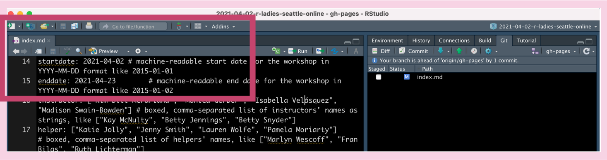
]

.panel[.panel-name[See Changes]
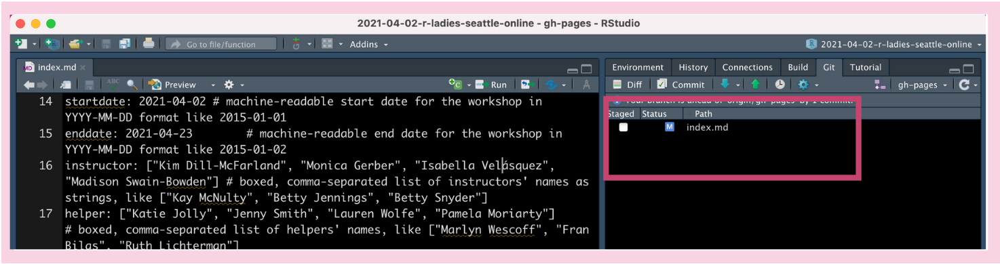
]

.panel[.panel-name[Click Commit]
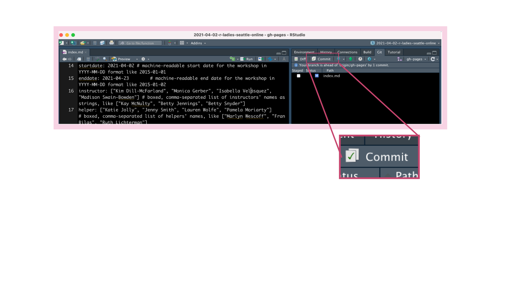
]

]

---

# Committing changes

* Stage your change

* Write a commit message

* Click "Commit"

* Push up changes

<center>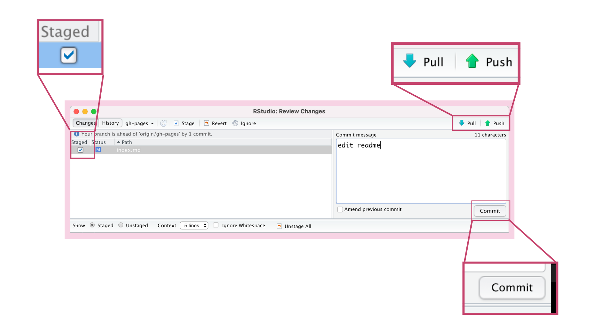</center>

---

# Cache credentials

.panelset[
.panel[.panel-name[Get PAT]

* GitHub > Settings > Developer Settings > Personal access tokens > Generate new tokens
* https://github.com/settings/tokens

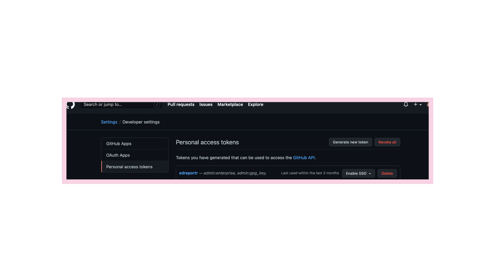

]

.panel[.panel-name[Save in R Environment]

* `usethis::edit_r_environ()`
* THEN RESTART RSTUDIO!

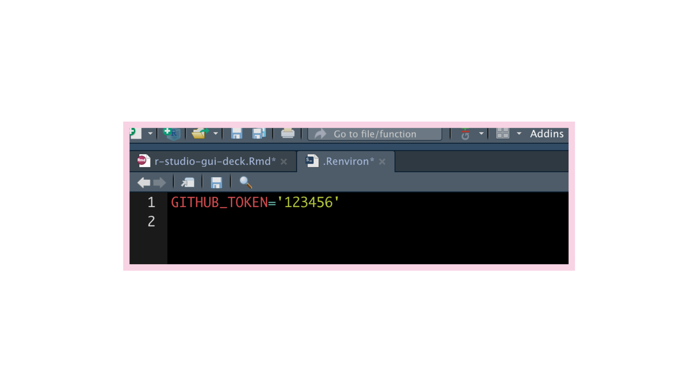

]
]
---

# Editing .gitignore

Say you want to create a directory called `graphs` and have Git ignore the files in the folder.

.pull-left[

```{r, eval = F}

dir.create("./graphs")

```

]

--
.pull-right[

In `.gitignore`:

```
.Rproj.user
.Rhistory
.RData
graphs/
```

]

---

# Other Git processes

.panelset[
.panel[.panel-name[Check History]
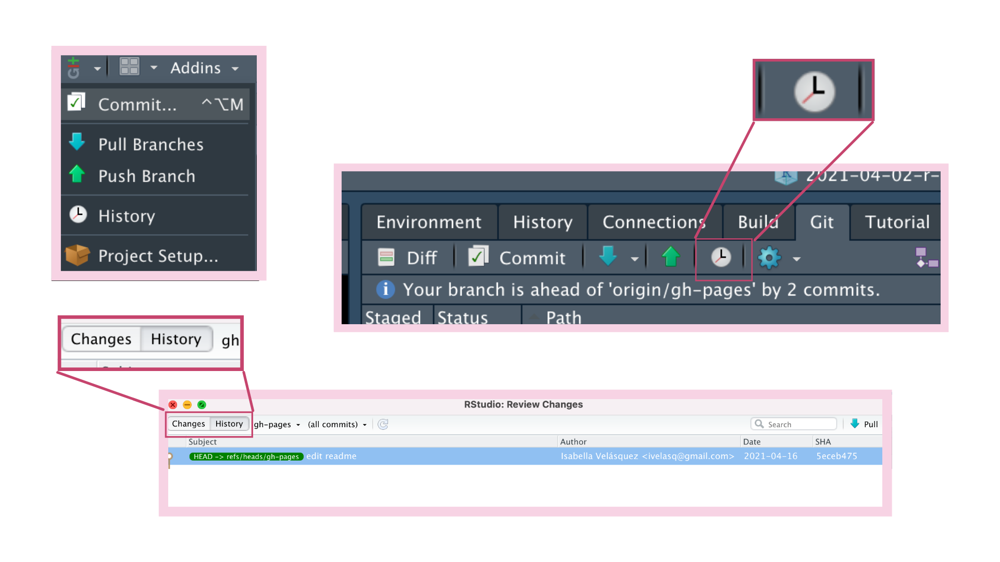
]

.panel[.panel-name[Ignore and Revert]
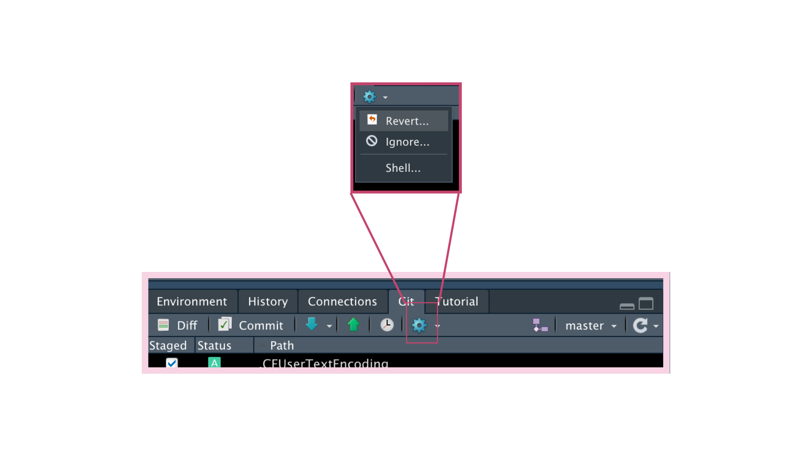
]

.panel[.panel-name[Create Branches]
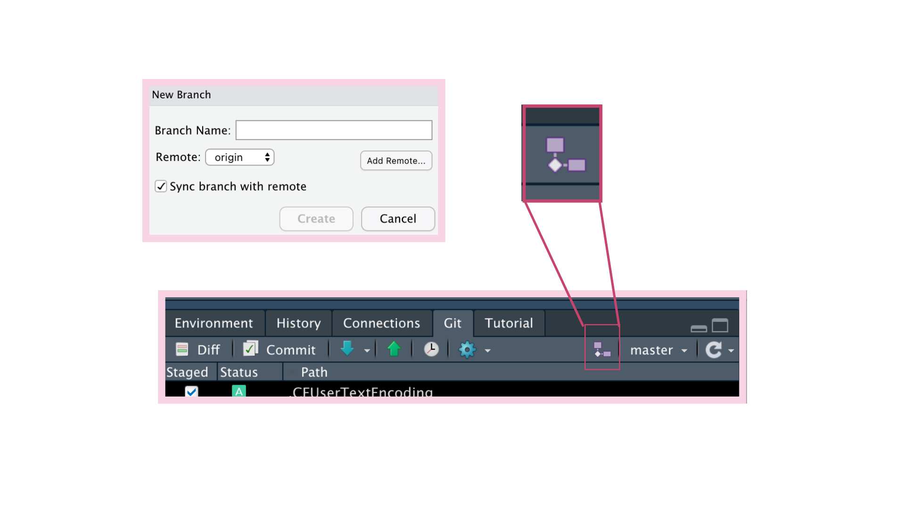
]

.panel[.panel-name[Switch Branches]
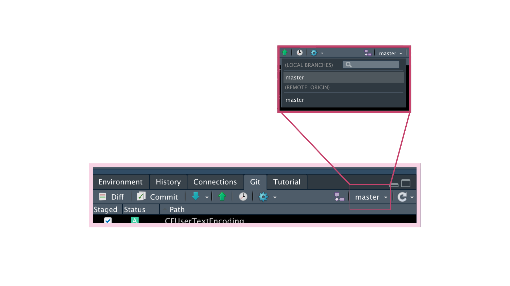
]
]

---

class: inverse, middle, left

.pull-left[

# Thank you!

### Here's where you can find me...

.right[
[ivelasq.rbind.io `r icons::fontawesome("link")`](https://ivelasq.rbind.io)<br/>
[@ivelasq3 `r icons::fontawesome("twitter")`](https://twitter.com/ivelasq3)<br/>
[@ivelasq `r icons::fontawesome("github")`](https://github.com/ivelasq)<br/>
]]

.pull-right[

]

---

# Resources

## Git

* [Carpentries Walkthrough of Version Control with Git: Setup](https://swcarpentry.github.io/git-novice/setup.html)

## Git & RStudio

* [Happy Git with R](https://happygitwithr.com/install-git.html#install-git)
* [Version Control with Git and SVN from RStudio](https://support.rstudio.com/hc/en-us/articles/200532077-Version-Control-with-Git-and-SVN?mobile_site=true)

## Xaringan
* [Sharing Your Work with Xaringan by Dr. Silvia Canelón](https://spcanelon.github.io/xaringan-basics-and-beyond/slides/day-01-basics.html)