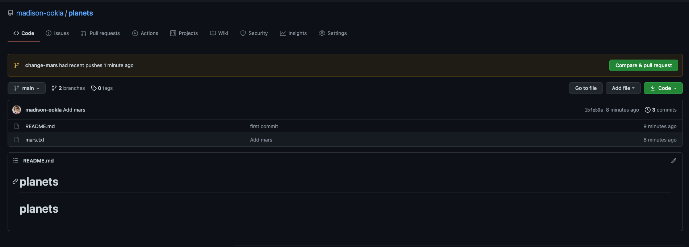

# Collaborating
**Questions**:
- How can I use version control to collaborate with other people?

**Objectives**:
- Clone a remote repository.
- Collaborate by pushing to a common repository.
- Describe the basic collaborative workflow.

**Keypoints**:
- `git clone` copies a remote repository to create a local repository with a remote called `origin` automatically set up.

---

For the next step, get into pairs.  One person will be the "Owner" and the other
will be the "Collaborator". The goal is that the Collaborator add changes into
the Owner's repository. We will switch roles at the end, so both persons will
play Owner and Collaborator.

> ## Practicing By Yourself
>
> If you're working through this lesson on your own, you can carry on by opening
> a second terminal window.
> This window will represent your partner, working on another computer. You
> won't need to give anyone access on GitHub, because both 'partners' are you.

The Owner needs to give the Collaborator access. On GitHub, click the settings
button on the right, select Manage access, click Invite a collaborator, and
then enter your partner's username.


To accept access to the Owner's repo, the Collaborator
needs to go to [https://github.com/notifications](https://github.com/notifications).
Once there she can accept access to the Owner's repo.

Next, the Collaborator needs to download a copy of the Owner's repository to her
 machine. This is called "cloning a repo". To clone the Owner's repo into
her `Desktop` folder, the Collaborator enters:

~~~bash
$ git clone https://github.com/vlad/planets.git ~/Desktop/vlad-planets
~~~

Replace 'vlad' with the Owner's username.


The Collaborator can now make a change in her clone of the Owner's repository,
exactly the same way as we've been doing before:

~~~bash
$ cd ~/Desktop/vlad-planets
$ nano pluto.txt
$ cat pluto.txt
~~~

~~~
It is so a planet!
~~~

~~~bash
$ git add pluto.txt
$ git commit -m "Add notes about Pluto"
~~~

~~~
 1 file changed, 1 insertion(+)
 create mode 100644 pluto.txt
~~~

Then push the change to the *Owner's repository* on GitHub:

~~~bash
$ git push origin main
~~~

~~~
Enumerating objects: 4, done.
Counting objects: 4, done.
Delta compression using up to 4 threads.
Compressing objects: 100% (2/2), done.
Writing objects: 100% (3/3), 306 bytes, done.
Total 3 (delta 0), reused 0 (delta 0)
To https://github.com/vlad/planets.git
   9272da5..29aba7c  main -> main
~~~

Note that we didn't have to create a remote called `origin`: Git uses this
name by default when we clone a repository.  (This is why `origin` was a
sensible choice earlier when we were setting up remotes by hand.)

> ## Some more about remotes
>
> In this episode and the previous one, our local repository has had
> a single "remote", called `origin`. A remote is a copy of the repository
> that is hosted somewhere else, that we can push to and pull from, and 
> there's no reason that you have to work with only one. For example, 
> on some large projects you might have your own copy in your own GitHub
> account (you'd probably call this `origin`) and also the main "upstream"
> project repository (let's call this `upstream` for the sake of examples).
> You would pull from `upstream` from time to 
> time to get the latest updates that other people have committed.
>
> Remember that the name you give to a remote only exists locally. It's
> an alias that you choose - whether `origin`, or `upstream`, or `fred` -
> and not something intrinstic to the remote repository.
>
> The `git remote` family of commands is used to set up and alter the remotes
> associated with a repository. Here are some of the most useful ones:
>
> * `git remote -v` lists all the remotes that are configured (we already used
> this in the last episode)
> * `git remote add [name] [url]` is used to add a new remote
> * `git remote remove [name]` removes a remote. Note that it doesn't affect the 
> remote repository at all - it just removes the link to it from the local repo.
> * `git remote set-url [name] [newurl]` changes the URL that is associated 
> with the remote. This is useful if it has moved, e.g. to a different GitHub
> account, or from GitHub to a different hosting service. Or, if we made a typo when
> adding it!
> * `git remote rename [oldname] [newname]` changes the local alias by which a remote 
> is known - its name. For example, one could use this to change `upstream` to `fred`.

Take a look to the Owner's repository on its GitHub website now (maybe you need
to refresh your browser.) You should be able to see the new commit made by the
Collaborator.

To download the Collaborator's changes from GitHub, the Owner now enters:

~~~bash
$ git pull origin main
~~~

~~~
remote: Enumerating objects: 4, done.
remote: Counting objects: 100% (4/4), done.
remote: Compressing objects: 100% (2/2), done.
remote: Total 3 (delta 0), reused 3 (delta 0), pack-reused 0
Unpacking objects: 100% (3/3), done.
From https://github.com/vlad/planets
 * branch            main     -> FETCH_HEAD
   9272da5..29aba7c  main     -> origin/main
Updating 9272da5..29aba7c
Fast-forward
 pluto.txt | 1 +
 1 file changed, 1 insertion(+)
 create mode 100644 pluto.txt
~~~

Now the three repositories (Owner's local, Collaborator's local, and Owner's on
GitHub) are back in sync.

> ## A Basic Collaborative Workflow
>
> In practice, it is good to be sure that you have an updated version of the
> repository you are collaborating on, so you should `git pull` before making
> our changes. The basic collaborative workflow would be:
>
> * update your local repo with `git pull origin main`,
> * make your changes and stage them with `git add`,
> * commit your changes with `git commit -m`, and
> * upload the changes to GitHub with `git push origin main`
>
> It is better to make many commits with smaller changes rather than
> of one commit with massive changes: small commits are easier to
> read and review.


---
# Conflicts
**Questions**:
- What do I do when my changes conflict with someone else's?
  
**Objectives**:
- Explain what conflicts are and when they can occur.
- Resolve conflicts resulting from a merge.
  
**Keypoints**:
- Conflicts occur when two or more people change the same lines of the same file.
- The version control system does not allow people to overwrite each other's changes blindly, but highlights conflicts so that they can be resolved.
---

As soon as people can work in parallel, they'll likely step on each other's
toes.  This will even happen with a single person: if we are working on
a piece of software on both our laptop and a server in the lab, we could make
different changes to each copy.  Version control helps us manage these
conflicts by giving us tools to resolve overlapping changes.

To see how we can resolve conflicts, we must first create one.  The file
`mars.txt` currently looks like this in both partners' copies of our `planets`
repository:

~~~bash
$ cat mars.txt
~~~

~~~
Cold and dry, but everything is my favorite color
The two moons may be a problem for Wolfman
But the Mummy will appreciate the lack of humidity
~~~

Let's add a line to the collaborator's copy only:

~~~bash
$ nano mars.txt
$ cat mars.txt
~~~

~~~
Cold and dry, but everything is my favorite color
The two moons may be a problem for Wolfman
But the Mummy will appreciate the lack of humidity
This line added to Wolfman's copy
~~~

and then push the change to GitHub:

~~~bash
$ git add mars.txt
$ git commit -m "Add a line in our home copy"
~~~

~~~
[main 5ae9631] Add a line in our home copy
 1 file changed, 1 insertion(+)
~~~

~~~bash
$ git push origin main
~~~

~~~
Enumerating objects: 5, done.
Counting objects: 100% (5/5), done.
Delta compression using up to 8 threads
Compressing objects: 100% (3/3), done.
Writing objects: 100% (3/3), 331 bytes | 331.00 KiB/s, done.
Total 3 (delta 2), reused 0 (delta 0)
remote: Resolving deltas: 100% (2/2), completed with 2 local objects.
To https://github.com/vlad/planets.git
   29aba7c..dabb4c8  main -> main
~~~

Now let's have the owner
make a different change to their copy
*without* updating from GitHub:

~~~bash
$ nano mars.txt
$ cat mars.txt
~~~

~~~
Cold and dry, but everything is my favorite color
The two moons may be a problem for Wolfman
But the Mummy will appreciate the lack of humidity
We added a different line in the other copy
~~~

We can commit the change locally:

~~~bash
$ git add mars.txt
$ git commit -m "Add a line in my copy"
~~~

~~~
[main 07ebc69] Add a line in my copy
 1 file changed, 1 insertion(+)
~~~

but Git won't let us push it to GitHub:

~~~bash
$ git push origin main
~~~

~~~
To https://github.com/vlad/planets.git
 ! [rejected]        main -> main (fetch first)
error: failed to push some refs to 'https://github.com/vlad/planets.git'
hint: Updates were rejected because the remote contains work that you do
hint: not have locally. This is usually caused by another repository pushing
hint: to the same ref. You may want to first integrate the remote changes
hint: (e.g., 'git pull ...') before pushing again.
hint: See the 'Note about fast-forwards' in 'git push --help' for details.
~~~


Git rejects the push because it detects that the remote repository has new updates that have not been
incorporated into the local branch.
What we have to do is pull the changes from GitHub,
merge them into the copy we're currently working in, and then push that.
Let's start by pulling:

~~~bash
$ git pull origin main
~~~

~~~
remote: Enumerating objects: 5, done.
remote: Counting objects: 100% (5/5), done.
remote: Compressing objects: 100% (1/1), done.
remote: Total 3 (delta 2), reused 3 (delta 2), pack-reused 0
Unpacking objects: 100% (3/3), done.
From https://github.com/vlad/planets
 * branch            main     -> FETCH_HEAD
    29aba7c..dabb4c8  main     -> origin/main
Auto-merging mars.txt
CONFLICT (content): Merge conflict in mars.txt
Automatic merge failed; fix conflicts and then commit the result.
~~~

The `git pull` command updates the local repository to include those
changes already included in the remote repository.
After the changes from remote branch have been fetched, Git detects that changes made to the local copy
overlap with those made to the remote repository, and therefore refuses to merge the two versions to
stop us from trampling on our previous work. The conflict is marked in
in the affected file:

~~~bash
$ cat mars.txt
~~~

~~~
Cold and dry, but everything is my favorite color
The two moons may be a problem for Wolfman
But the Mummy will appreciate the lack of humidity
<<<<<<< HEAD
We added a different line in the other copy
=======
This line added to Wolfman's copy
>>>>>>> dabb4c8c450e8475aee9b14b4383acc99f42af1d
~~~

Our change is preceded by `<<<<<<< HEAD`.
Git has then inserted `=======` as a separator between the conflicting changes
and marked the end of the content downloaded from GitHub with `>>>>>>>`.
(The string of letters and digits after that marker
identifies the commit we've just downloaded.)

It is now up to us to edit this file to remove these markers
and reconcile the changes.
We can do anything we want: keep the change made in the local repository, keep
the change made in the remote repository, write something new to replace both,
or get rid of the change entirely.
Let's replace both so that the file looks like this:

~~~bash
$ cat mars.txt
~~~

~~~
Cold and dry, but everything is my favorite color
The two moons may be a problem for Wolfman
But the Mummy will appreciate the lack of humidity
We removed the conflict on this line
~~~

To finish merging,
we add `mars.txt` to the changes being made by the merge
and then commit:

~~~bash
$ git add mars.txt
$ git status
~~~

~~~
On branch main
All conflicts fixed but you are still merging.
  (use "git commit" to conclude merge)

Changes to be committed:

	modified:   mars.txt

~~~

~~~bash
$ git commit -m "Merge changes from GitHub"
~~~

~~~
[main 2abf2b1] Merge changes from GitHub
~~~

Now we can push our changes to GitHub:

~~~bash
$ git push origin main
~~~

~~~
Enumerating objects: 10, done.
Counting objects: 100% (10/10), done.
Delta compression using up to 8 threads
Compressing objects: 100% (6/6), done.
Writing objects: 100% (6/6), 645 bytes | 645.00 KiB/s, done.
Total 6 (delta 4), reused 0 (delta 0)
remote: Resolving deltas: 100% (4/4), completed with 2 local objects.
To https://github.com/vlad/planets.git
   dabb4c8..2abf2b1  main -> main
~~~

Git keeps track of what we've merged with what,
so we don't have to fix things by hand again
when the collaborator who made the first change pulls again:

~~~bash
$ git pull origin main
~~~

~~~
remote: Enumerating objects: 10, done.
remote: Counting objects: 100% (10/10), done.
remote: Compressing objects: 100% (2/2), done.
remote: Total 6 (delta 4), reused 6 (delta 4), pack-reused 0
Unpacking objects: 100% (6/6), done.
From https://github.com/vlad/planets
 * branch            main     -> FETCH_HEAD
    dabb4c8..2abf2b1  main     -> origin/main
Updating dabb4c8..2abf2b1
Fast-forward
 mars.txt | 2 +-
 1 file changed, 1 insertion(+), 1 deletion(-)
~~~

We get the merged file:

~~~bash
$ cat mars.txt
~~~

~~~
Cold and dry, but everything is my favorite color
The two moons may be a problem for Wolfman
But the Mummy will appreciate the lack of humidity
We removed the conflict on this line
~~~

We don't need to merge again because Git knows someone has already done that.

Git's ability to resolve conflicts is very useful, but conflict resolution
costs time and effort, and can introduce errors if conflicts are not resolved
correctly. If you find yourself resolving a lot of conflicts in a project,
consider these technical approaches to reducing them:

- Pull from upstream more frequently, especially before starting new work
- Use topic branches to segregate work, merging to main when complete
- Make smaller more atomic commits
- Where logically appropriate, break large files into smaller ones so that it is
  less likely that two authors will alter the same file simultaneously

Conflicts can also be minimized with project management strategies:

- Clarify who is responsible for what areas with your collaborators
- Discuss what order tasks should be carried out in with your collaborators so
  that tasks expected to change the same lines won't be worked on simultaneously
- If the conflicts are stylistic churn (e.g. tabs vs. spaces), establish a
  project convention that is governing and use code style tools (e.g.
  `htmltidy`, `perltidy`, `rubocop`, etc.) to enforce, if necessary

> ## Solving Conflicts that You Create
>
> Clone the repository created by your instructor.
> Add a new file to it,
> and modify an existing file (your instructor will tell you which one).
> When asked by your instructor,
> pull her changes from the repository to create a conflict,
> then resolve it.

<details><summary>Conflicts on Non-textual files</summary>

> ## Conflicts on Non-textual files
>
> What does Git do
> when there is a conflict in an image or some other non-textual file
> that is stored in version control?
>
> > ## Solution
> >
> > Let's try it. Suppose Dracula takes a picture of Martian surface and
> > calls it `mars.jpg`.
> >
> > If you do not have an image file of Mars available, you can create
> > a dummy binary file like this:
> >
> > ~~~
> > $ head -c 1024 /dev/urandom > mars.jpg
> > $ ls -lh mars.jpg
> > ~~~
> >
> > ~~~
> > -rw-r--r-- 1 vlad 57095 1.0K Mar  8 20:24 mars.jpg
> > ~~~
> >
> > `ls` shows us that this created a 1-kilobyte file. It is full of
> > random bytes read from the special file, `/dev/urandom`.
> >
> > Now, suppose Dracula adds `mars.jpg` to his repository:
> >
> > ~~~
> > $ git add mars.jpg
> > $ git commit -m "Add picture of Martian surface"
> > ~~~
> >
> > ~~~
> > [main 8e4115c] Add picture of Martian surface
> >  1 file changed, 0 insertions(+), 0 deletions(-)
> >  create mode 100644 mars.jpg
> > ~~~
> >
> > Suppose that Wolfman has added a similar picture in the meantime.
> > His is a picture of the Martian sky, but it is *also* called `mars.jpg`.
> > When Dracula tries to push, he gets a familiar message:
> >
> > ~~~
> > $ git push origin main
> > ~~~
> >
> > ~~~
> > To https://github.com/vlad/planets.git
> >  ! [rejected]        main -> main (fetch first)
> > error: failed to push some refs to 'https://github.com/vlad/planets.git'
> > hint: Updates were rejected because the remote contains work that you do
> > hint: not have locally. This is usually caused by another repository pushing
> > hint: to the same ref. You may want to first integrate the remote changes
> > hint: (e.g., 'git pull ...') before pushing again.
> > hint: See the 'Note about fast-forwards' in 'git push --help' for details.
> > ~~~
> >
> > We've learned that we must pull first and resolve any conflicts:
> >
> > ~~~
> > $ git pull origin main
> > ~~~
> >
> > When there is a conflict on an image or other binary file, git prints
> > a message like this:
> >
> > ~~~
> > $ git pull origin main
> > remote: Counting objects: 3, done.
> > remote: Compressing objects: 100% (3/3), done.
> > remote: Total 3 (delta 0), reused 0 (delta 0)
> > Unpacking objects: 100% (3/3), done.
> > From https://github.com/vlad/planets.git
> >  * branch            main     -> FETCH_HEAD
> >    6a67967..439dc8c  main     -> origin/main
> > warning: Cannot merge binary files: mars.jpg (HEAD vs. 439dc8c08869c342438f6dc4a2b615b05b93c76e)
> > Auto-merging mars.jpg
> > CONFLICT (add/add): Merge conflict in mars.jpg
> > Automatic merge failed; fix conflicts and then commit the result.
> > ~~~
> >
> > The conflict message here is mostly the same as it was for `mars.txt`, but
> > there is one key additional line:
> >
> > ~~~
> > warning: Cannot merge binary files: mars.jpg (HEAD vs. 439dc8c08869c342438f6dc4a2b615b05b93c76e)
> > ~~~
> >
> > Git cannot automatically insert conflict markers into an image as it does
> > for text files. So, instead of editing the image file, we must check out
> > the version we want to keep. Then we can add and commit this version.
> >
> > On the key line above, Git has conveniently given us commit identifiers
> > for the two versions of `mars.jpg`. Our version is `HEAD`, and Wolfman's
> > version is `439dc8c0...`. If we want to use our version, we can use
> > `git checkout`:
> >
> > ~~~
> > $ git checkout HEAD mars.jpg
> > $ git add mars.jpg
> > $ git commit -m "Use image of surface instead of sky"
> > ~~~
> >
> > ~~~
> > [main 21032c3] Use image of surface instead of sky
> > ~~~
> >
> > If instead we want to use Wolfman's version, we can use `git checkout` with
> > Wolfman's commit identifier, `439dc8c0`:
> >
> > ~~~
> > $ git checkout 439dc8c0 mars.jpg
> > $ git add mars.jpg
> > $ git commit -m "Use image of sky instead of surface"
> > ~~~
> >
> > ~~~
> > [main da21b34] Use image of sky instead of surface
> > ~~~
> >
> > We can also keep *both* images. The catch is that we cannot keep them
> > under the same name. But, we can check out each version in succession
> > and *rename* it, then add the renamed versions. First, check out each
> > image and rename it:
> >
> > ~~~
> > $ git checkout HEAD mars.jpg
> > $ git mv mars.jpg mars-surface.jpg
> > $ git checkout 439dc8c0 mars.jpg
> > $ mv mars.jpg mars-sky.jpg
> > ~~~
> >
> > Then, remove the old `mars.jpg` and add the two new files:
> >
> > ~~~
> > $ git rm mars.jpg
> > $ git add mars-surface.jpg
> > $ git add mars-sky.jpg
> > $ git commit -m "Use two images: surface and sky"
> > ~~~
> >
> > ~~~
> > [main 94ae08c] Use two images: surface and sky
> >  2 files changed, 0 insertions(+), 0 deletions(-)
> >  create mode 100644 mars-sky.jpg
> >  rename mars.jpg => mars-surface.jpg (100%)
> > ~~~
> >
> > Now both images of Mars are checked into the repository, and `mars.jpg`
> > no longer exists.
</details>


---
# Branches & Pull Requests
**Questions**:
- How do I collaborate with someone simultaneously?

**Objectives**:
- Explain what branches are and when to use them.
- Submit a PR with a branch that was made.

**Keypoints**:
- Branches can be used to collaborate on a project simultaneously without constant merges.
- Pull requests are a way to submit a series of changes done on a branch to be merged.
---

The above examples showcase a workflow for collaborating on a single branch.
For scenarios where two or more people are working on a project, this can become
troublesome with the constant merging. One way to avoid this is to use "branches".

Branches are a way of operating on a version of the project without impeding on other
people's work.

To see this in action, let's continue from the setup above. On both copies of the
`planets` repository, the `mars.txt` file should look like this:

```bash
$ cat mars.txt
```

```
Cold and dry, but everything is my favorite color
The two moons may be a problem for Wolfman
But the Mummy will appreciate the lack of humidity
We removed the conflict on this line
```

We'll simulate simultaneous changes by creating a branch on the collaborator's copy:

```bash
$ git checkout -b change-mars
```

```
Switched to a new branch 'change-mars'
```

Here we can add a change to the `mars.txt` file:

~~~bash
$ nano mars.txt
$ cat mars.txt
~~~

~~~
Cold and dry, but everything is my favorite color
There is a helicopter on it now!
The two moons may be a problem for Wolfman
But the Mummy will appreciate the lack of humidity
~~~

Then we can commit it, and push a copy of the branch to the remote repository:

```bash
$ git add mars.txt
$ git commit -m "More info about mars"
$ git push -u origin change-mars
```

We can also switch back to the `main` branch and make a different change there:

```bash
$ git checkout main
$ nano mars.txt
$ cat mars.txt
```

```
Cold and dry, but everything is my favorite color
The two moons may be a problem for Wolfman
But the Mummy will appreciate the lack of humidity
Add a line at the end
```

Now, we have two changes to the same file which exist on different branches, and do not
interfere with one another! We can continue to make changes on each branch. As long
as the changes don't directly overlap, we will be able to merge them easily.

GitHub (and many other git services) has a process for merging code from one branch to
another while allowing contributors to review the code. This is called a "pull request"
(though for all intents and purposes it can be thought of as a "merge request").

We can go to our repository's page on GitHub, and we should be greeted with a prompt
about our recently pushed branch:



Once on that page, we can add a description and submit the pull request.


Once the pull request is ready, GitHub can merge it for you!


# Final Notes

- Branches are great for collaborative development.
- GitHub enables us to merge branches through the Pull Request process.
- Avoid conflicts if you can!
- One command I've found helpful is `git log --all --decorate --oneline --graph`
  (helpfully remembered as `git log ADOG` 🐕)
